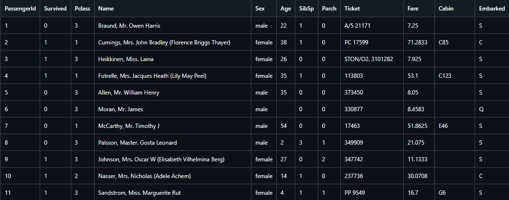

<h2 align="center">

  
:construction: Analisis-Tictanic :construction:
</h2>

¿Por que no analisar la historia del Titanic?. Muchos investigadores han dedicado su esfuerzo a reconstruir los restos del famoso barco, con el objetivo de comprender cómo fueron sus horas finales y las de sus pasajeros.Espero que te guste esta versión. 

<h1> Para trabajar en ello necesitamos:</h1>

<h4>instalacion de <a href="https://github.com/condebufon/Analisis-Tictanic/blob/main/Instalacion.md"><u>entorno virtual </u></a></h4>
<h4>⏩⏩Paso 8: Abrir y trabajar con notebooks</h4>
Desde la interfaz de Jupyter, abre los archivos .ipynb que se encuentran en el repositorio para comenzar a trabajar con ellos.
Siguiendo estos pasos, podrás configurar un entorno virtual y trabajar con el repositorio Analisis-Tictanic en Jupyter.

<h1>⏩⏩Trabajo futuro
</h1>

<h3 align=justify>Dataset</h3>
Un dataset, o conjunto de datos, es una colección estructurada de información que utilizo para analizar y comprender diferentes variables. Generalmente, lo veo como una tabla donde cada columna representa una variable específica y cada fila corresponde a un registro individual. Por ejemplo, en el dataset con el que estoy trabajando, tengo variables como Pclass (clase del pasajero), Sex (género del pasajero), Age (edad del pasajero), entre otras.

<h4 align=justify>
<h4>¿Qué variables contiene el dataset?</h4>
<h4>El dataset incluye varias variables importantes que me permiten analizar la información de los pasajeros, tales como:

    ⏺Pclass: Clase del pasajero (1, 2 o 3).
    ⏺Sex: Género del pasajero (masculino o femenino).
    ⏺Age: Edad del pasajero.
    ⏺SibSp: Número de hermanos o cónyuges a bordo.
    ⏺Parch: Número de padres o hijos a bordo.
    ⏺Fare: Tarifa pagada por el pasajero.
    ⏺Embarked: Puerto de embarque (C = Cherburgo, Q = Queenstown, S = Southampton).</h4>
<h4>¿Cuántas filas y columnas tiene el dataset?
    El dataset tiene un total de 891 filas y 12 columnas, lo que significa que tengo información sobre 891 pasajeros y 12 características diferentes para cada uno.</h4>
<h4>¿Existen valores nulos o duplicados? ¿Cómo se van a manejar?
    He encontrado algunos valores nulos en ciertas columnas, especialmente en la variable Age, donde hay varios pasajeros sin edad registrada. No he encontrado registros duplicados. Para manejar los valores nulos, planeo utilizar técnicas como la imputación de la edad utilizando la media o mediana de las edades disponibles y, si es necesario, considerar eliminar filas con valores nulos en otras variables críticas.</h4>
<h4>¿Qué tipo de variables (categóricas, continuas, etc.) están presentes?
    El dataset contiene una mezcla de tipos de variables:
    
    Variables categóricas:
        Pclass
        Sex
        Embarked
    Variables continuas:
        Age
        Fare
    Variables discretas:
        SibSp
        Parch</h4>
<h4>Origen de los Datos: Descripción de la fuente de datos y su relevancia para el proyecto.</h4>
<h4>Estructura del Dataset: Análisis de las columnas, tipos de datos y la cantidad de registros.</h4>
<h4>Calidad de los Datos: Identificación de problemas potenciales como valores nulos, duplicados o inconsistencias que puedan afectar el análisis posterior.</h4>
Estrategia ETL a Seguir
<h3>La estrategia ETL (Extracción, Transformación y Carga) </h3>

 es fundamental para garantizar que los datos sean útiles y estén listos para el análisis. La estrategia se desglosa en tres etapas:
<h4 align=justify>Extracción:
Métodos de Extracción: Se describirá cómo se extraerán los datos desde la fuente original, ya sea a través de APIs, bases de datos o archivos planos.</h4>
Frecuencia de Extracción: Determinación de si la extracción será puntual o periódica.
<h4 align=justify>Transformación:
Motivos para Transformar: Explicación sobre la necesidad de limpiar y preparar los datos para el análisis. Esto incluye la normalización de formatos y la eliminación de registros irrelevantes.
Métodos de Transformación: Detalle sobre las técnicas utilizadas, como la agregación, filtrado y creación de nuevas columnas.</h4>
<h4>todo esto se vera en el notebooks de transformacion</h4>

<h4 align=justify>Carga:
Destino de Carga: Descripción del sistema o base de datos donde se cargarán los datos transformados.
Frecuencia de Carga: Indicación sobre si la carga será en tiempo real o programada</h4>

<h3>el tema de  visualizaciones las podra apreciar en <a href="https://github.com/condebufon/Analisis-Tictanic/blob/main/dataviz.ipynb"> visualizaciones</a></h3>
<h1>visualeremos en este analis datos como:</h1>

<h2>⏺Datos de la tripulacion del Titanic</h2>

<h2>⏺Datos en graficas </h2>

<h2>⏺Estructura del proyecto</h2>

cualquier duda o observacion contactar a: https://api.whatsapp.com/send/?phone=573157511161
